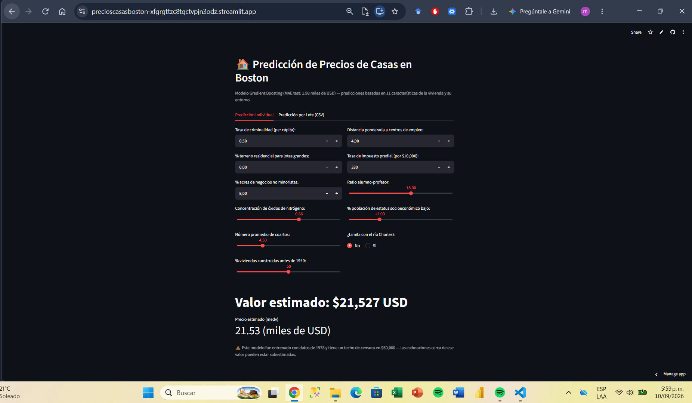
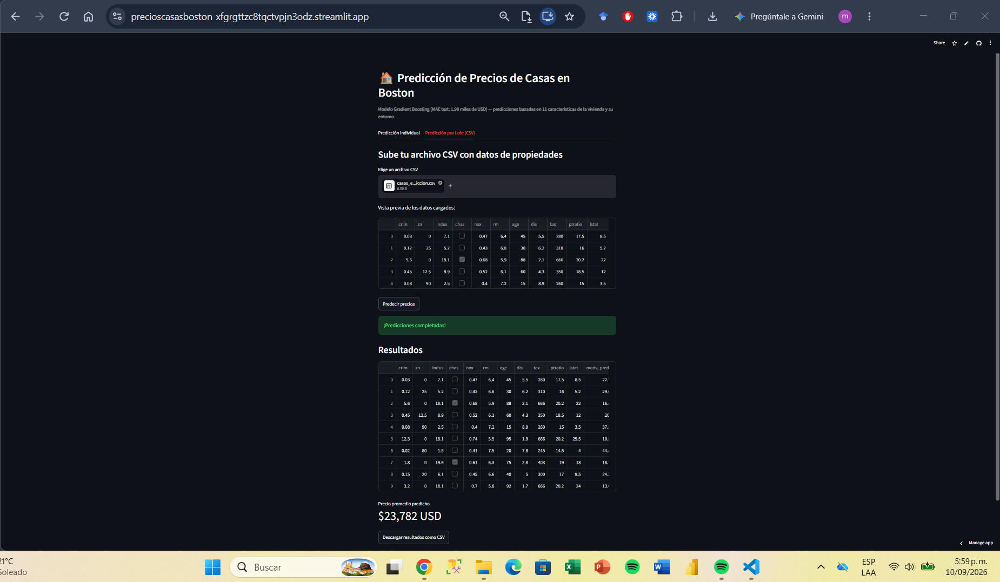

# Demo — Predicción de Precios de Casas en Boston

Aplicación interactiva construida con [Streamlit](https://streamlit.io/) que permite predecir
el precio de una vivienda en Boston usando el modelo Gradient Boosting entrenado en el Paso 6
del proyecto (MAE test: 1.98 miles de USD).

## Cómo ejecutar

Desde la raíz del proyecto:

```bash
uv sync
uv run streamlit run notebooks/7-deploy/boston-streamlit.py
```

La aplicación se abrirá automáticamente en el navegador en `http://localhost:8501`. Si no se
abre sola (común en entornos WSL2), copia esa URL manualmente en tu navegador.

Para detener el servidor: `Ctrl+C` en la terminal.

## Requisitos previos

Deben existir los siguientes artefactos en la carpeta `models/` (generados en pasos
anteriores del proyecto):

- `preprocessor_pipeline.joblib` — pipeline de Feature Engineering (Paso 4)
- `best_model.joblib` — modelo Gradient Boosting entrenado (Paso 6)

Si no existen, deben regenerarse corriendo en orden los notebooks de los Pasos 1 a 6.

## Funcionalidades

### Predicción Individual

Formulario con las 11 variables predictoras del modelo (crim, zn, indus, chas, nox, rm, age,
dis, tax, ptratio, lstat), con valores por defecto razonables y rangos acotados a los
observados en el dataset original.

### Predicción por Lote (CSV)

Permite subir un archivo CSV con múltiples propiedades y obtener predicciones para todas a la
vez, con opción de descargar los resultados. El CSV debe incluir las 11 columnas requeridas
(ver formato de ejemplo dentro de la app si no se sube ningún archivo).

## Advertencia sobre el modelo

El dataset original (Boston Housing, 1978) tiene un techo de censura en $50,000 — las
propiedades con valor real igual o superior a ese monto fueron registradas como exactamente
$50,000. Las predicciones cercanas a ese valor pueden estar subestimadas (ver análisis
detallado en `notebooks/6-interpretation/`).

## 🌐 Demo pública

La aplicación está desplegada en [Streamlit Community Cloud](https://streamlit.io/cloud)
y accesible públicamente en:

**[https://precioscasasboston-xfgrgttzc8tqctvpjn3odz.streamlit.app/](https://precioscasasboston-xfgrgttzc8tqctvpjn3odz.streamlit.app/)**

No requiere instalación ni configuración de ningún tipo — cualquier persona con el enlace
puede usarla directamente desde su navegador, sin necesidad de clonar el repositorio ni
tener Python instalado.

### Cómo usarla

#### Predicción individual

1. Abre el enlace en tu navegador
2. En la pestaña **"Predicción Individual"**, ajusta los sliders e inputs numéricos con
   las 11 características de la vivienda (tasa de criminalidad, número de cuartos,
   distancia a centros de empleo, etc.)
3. La predicción del precio (`medv`) se actualiza automáticamente en la parte inferior,
   mostrando el valor estimado en miles y en dólares completos

### Predicción por lote

1. En la pestaña **"Predicción por Lote (CSV)"**, sube un archivo CSV con las 11 columnas
   requeridas (ver formato exacto en la sección de archivos de ejemplo, más abajo)
2. La app valida que el archivo tenga las columnas correctas antes de procesarlo
3. Descarga el resultado, que incluye tus datos originales más una columna nueva
   `medv_predicho` con la estimación de cada registro

### Modelo detrás de la demo

La app consume los artefactos generados por el Training Pipeline del Trabajo 2
(`models/model.joblib`, `models/preprocessor.joblib`) — un modelo Gradient Boosting con
MAE de test de 1.98 (miles de USD). Ver `src/pipelines/training_pipeline/` para el
proceso completo de entrenamiento y validación.

### Limitaciones conocidas

- El modelo fue entrenado con datos de 1978 (dataset Boston Housing) — no refleja precios
  ni condiciones de mercado actuales
- Existe un techo de censura en los datos originales: los valores reales de vivienda por
  encima de $50,000 fueron registrados como exactamente $50,000, lo que puede hacer que
  las predicciones cercanas a ese valor estén subestimadas

## 📊 Archivos de ejemplo (batch)

- [`data/05_model_input/casas_ejemplo_prediccion_input.csv`](../../data/05_model_input/casas_ejemplo_prediccion_input.csv):
  10 registros de entrada con las 11 columnas requeridas
- [`data/07_model_output/casas_ejemplo_prediccion_output.csv`](../../data/07_model_output/casas_ejemplo_prediccion_output.csv):
  resultado real generado por la demo pública, con la columna `medv_predicho` agregada
  
## 📸 Evidencia de funcionamiento

### Prediccion individual



### Predicción por lote (batch)


